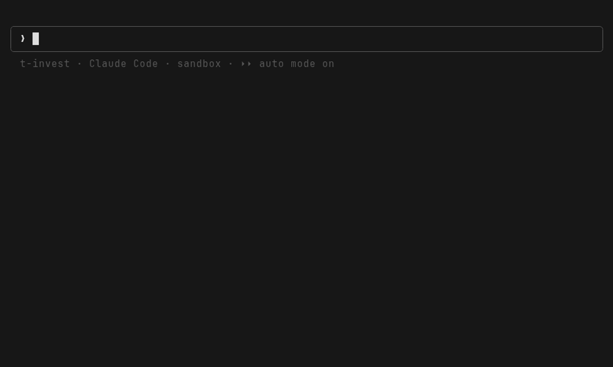
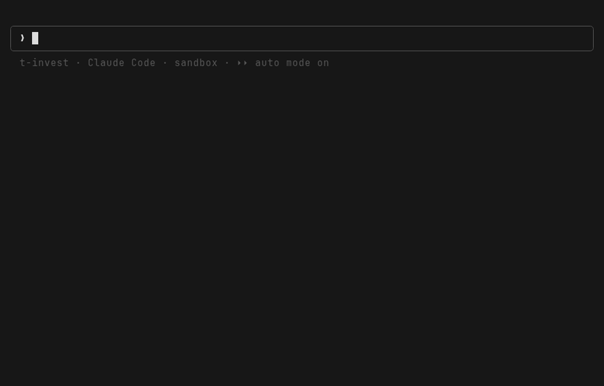

# t-invest-mcp

**Твой портфель Т-Инвестиций — в диалоге с AI.**

MCP-сервер, который подключает Claude (Claude Code, Claude Desktop — и любой другой
MCP-клиент) к [T-Invest API](https://developer.tbank.ru/invest/). Смотри портфель,
анализируй бумаги, считай выплаты и ребалансировку — обычными фразами, на русском.



Это не торговый робот и не «сигналы». Решения всегда принимаешь ты — сервер лишь
даёт модели безопасный доступ к данным твоего брокерского счёта.

## Почему это безопасно

- **Read-only по умолчанию.** Торговые операции даже не регистрируются, пока ты их
  явно не включишь. Достаточно токена **«только чтение»**.
- **Сделки — только с твоего подтверждения.** Если включишь торговлю, перед каждой
  заявкой сервер показывает диалог «Купить N лотов X?» — без явного «да» заявка
  не уйдёт, какими бы настройками ни пользовался агент.
- **Песочница.** Любую идею можно обкатать на виртуальном счёте с реальными котировками.
- Токен живёт только в переменной окружения — не в коде, не в конфиге, не в логах.
  Для продакшена держи его в системном keychain, а не в shell-профиле —
  рецепт в [docs/secure-token.md](docs/secure-token.md).

## Быстрый старт (5 минут)

Нужен Node.js ≥ 22 и аккаунт Т-Инвестиций.

1. **Токен.** В [настройках Т-Инвестиций](https://www.tbank.ru/invest/settings/api/)
   выпусти токен «только чтение». «Подтверждение сделок кодом» должно быть выключено.
   Токен показывается один раз; живёт 3 месяца с последнего использования.
2. **Подключение к Claude Code** — одной командой, установка не нужна
   (пакет [`t-invest-mcp`](https://www.npmjs.com/package/t-invest-mcp) подтянется из npm):

   ```bash
   claude mcp add t-invest \
     -e TINKOFF_API_TOKEN=<ваш-токен> \
     -- npx -y t-invest-mcp
   ```

   Для Claude Desktop тот же блок добавляется в Settings → Developer → Edit Config.
   Этот JSON подходит и любому другому MCP-клиенту (Cursor, VS Code, Windsurf и др.) —
   меняется только место, куда его вписать:

   ```json
   {
     "mcpServers": {
       "t-invest": {
         "command": "npx",
         "args": ["-y", "t-invest-mcp"],
         "env": { "TINKOFF_API_TOKEN": "<ваш-токен>" }
       }
     }
   }
   ```

   <details><summary>Вариант из исходников (для разработки)</summary>

   ```bash
   git clone https://github.com/human-turn/t-invest-mcp && cd t-invest-mcp
   npm install && npm run build
   # далее в командах выше вместо "npx -y t-invest-mcp" → "node /path/to/t-invest-mcp/dist/index.js"
   ```

   </details>

   В такой минимальной конфигурации сервер **строго read-only**: смотреть и
   анализировать можно всё, торговать — нельзя (торговые операции даже не
   регистрируются). Остальные возможности включаются переменными в `env` —
   каждая выключена по умолчанию:

   | Переменная | Что включает |
   |---|---|
   | `TINKOFF_SANDBOX=true` | [Песочница](#торговля-опционально-по-умолчанию-выключена): виртуальный счёт на реальных котировках — безопасная обкатка (нужен отдельный sandbox-токен) |
   | `TINKOFF_ALLOW_TRADING=true` | [Торговля](#торговля-опционально-по-умолчанию-выключена): выставление/отмена заявок, каждая сделка — с вашего подтверждения (нужен full-access токен) |
   | `TINKOFF_OUTPUT_DIR=<путь>` | Куда складывать [файловые выгрузки](#выгрузка-в-файл--детали) (по умолчанию — папка проекта) |
   | `TINKOFF_CONFIRM=off` | Отключить диалог подтверждения сделок — только для песочницы |

3. **Проверка:** спроси «покажи мои счета и портфель».

## Готовое из коробки: ритуалы



Не хочешь придумывать запросы — в сервер зашиты готовые рецепты. В Claude Code они
появляются как slash-команды `/t-invest:<имя>`:

| Ритуал | Что делает |
|---|---|
| `weekly [сумма]` | Дайджест недели: что выросло/упало и почему, события впереди; если указать сумму пополнения — план докупок |
| `monthly` | Итоги месяца: честная доходность (XIRR с учётом пополнений), выплаты, комиссии + календарь выплат |
| `quarterly` | Обзор портфеля + проверка, не пора ли ребалансировать |

И отдельные команды под конкретные задачи:

| Команда | Что делает |
|---|---|
| `portfolio_review` | Полный обзор: структура, концентрация, риски |
| `payout_calendar` | Купоны и дивиденды на N месяцев вперёд, средняя выплата в месяц |
| `bond_picker <сумма> <горизонт>` | Подбор облигаций: доходность с НКД, фильтр оферт, лесенка |
| `rebalance_check` | Дрейф от целевых долей + план сделок в лотах (без исполнения) |
| `invest_cash <сумма>` | Пришла зарплата: куда докупить, чтобы приблизиться к целям |
| `position_deep_dive <тикер>` | Разбор бумаги: фундаментал, прогнозы, выплаты, динамика |
| `tax_helper [год]` | Налоги за год + кандидаты на льготу долгосрочного владения |
| `div_screener [мин. %]` | Скрининг дивидендных акций MOEX |
| `monthly_report`, `weekly_digest`, `fire_progress` | Составные части ритуалов — можно вызывать отдельно |
| `feedback [тема]` | Что-то не работает? Соберёт репорт с диагностикой для разработчиков (без токена и личных данных) |

Все команды **анализируют и предлагают** — ни одна не совершает сделок сама.

### Нашли проблему? `/t-invest:feedback`

Команда сама собирает репорт для разработчиков: диагностику сервера
(`get_server_info` — версия, режимы, окружение), шаги воспроизведения и точные
тексты ошибок из диалога. Перед сохранением **покажет вам текст и спросит,
маскировать ли номера счетов и суммы** — токен не попадает в репорт никогда.
Результат ложится в `feedback/FEEDBACK-<дата>-<тема>.md`; дальше по желанию —
GitHub issue в один шаг или отправьте файл сами.

## Своя стратегия

Главное свойство сервера: он **не навязывает методологию**. Команды выше — это
бонус, а не рамки. Под капотом — 20+ инструментов-кирпичиков (портфель, операции,
котировки, купоны, фундаментал, прогнозы…), из которых модель собирает ответ на
любой твой вопрос:

- **Просто спрашивай.** «Какая у меня доля валютных активов?», «сравни мои
  нефтяные бумаги по P/E», «что будет с купонами, если продам половину ОФЗ?» —
  без всяких команд.
- **Опиши свои правила текстом.** Положи свою стратегию в `CLAUDE.md` проекта
  («не больше 10% на эмитента», «дивиденды реинвестирую в облигации», «новые
  позиции — только после разбора отчётности») — и агент будет учитывать её в
  каждом ответе.
- **Целевые доли — если нужны.** Файл `portfolio-target.json` в корне проекта
  включает ребалансировку и план докупок. Минимум — только доли классов;
  `byTicker` и финансовые цели (`goals`) — опциональные надстройки.
  Эталон: MCP-ресурс `t-invest://portfolio-target/example`.

  ```json
  { "targets": { "shares": 55, "bonds": 30, "etf": 10, "cash": 5 } }
  ```

- **Данные — в свои руки.** Каждый инструмент умеет выгружать результат в файл
  (`outputPath`, CSV/JSON) — сырые данные не съедают контекст диалога, а попадают
  на диск для pandas/Excel/чего угодно. `get_operations` при этом выкачивает всю
  историю операций, `get_candles` — годы свечей, а `download_history_archive`
  забирает минутки целыми годами (1 запрос = 1 год; доступные годы покажет
  `get_history_archive_years`). Дальше — любая своя аналитика: бэктесты, графики, отчёты.

## Торговля (опционально, по умолчанию выключена)

Если хочешь не только анализировать, но и исполнять — включи явно:

```bash
TINKOFF_ALLOW_TRADING=true   # регистрирует place_order / cancel_order
```

Понадобится full-access токен. Защита трёхслойная:

1. **Подтверждение в самом сервере** (включено по умолчанию): перед заявкой —
   диалог человеку через MCP elicitation; клиенты без поддержки elicitation
   получают отказ. Отключение — `TINKOFF_CONFIRM=off` (рекомендуется только
   для песочницы).
2. **Ask-правила Claude Code** (клиентский слой, срабатывает ещё до вызова):

   ```json
   {
     "permissions": {
       "allow": ["mcp__t-invest"],
       "ask": ["mcp__t-invest__place_order", "mcp__t-invest__cancel_order"]
     }
   }
   ```

   Приоритет deny → ask → allow гарантирует промпт в любом режиме, включая
   `bypassPermissions`. MCP tool annotations (`destructiveHint`) — лишь подсказки,
   Claude Code их не учитывает.
3. **Песочница для обкатки:**

   ```bash
   TINKOFF_API_TOKEN=<sandbox-токен> TINKOFF_SANDBOX=true TINKOFF_ALLOW_TRADING=true
   ```

   Счета/портфель/заявки уходят в песочницу (виртуальные деньги, реальные
   котировки), появляются `sandbox_*` инструменты. Попроси агента: «открой
   sandbox-счёт, положи миллион и собери модельный портфель 60/40».

## Справочник

### Переменные окружения

| Переменная | Значение | Описание |
|---|---|---|
| `TINKOFF_API_TOKEN` | обязательна | Токен T-Invest API (read-only достаточно для базового режима) |
| `TINKOFF_SANDBOX` | `true`/`false` | Песочница: счета/портфель/заявки идут в sandbox, регистрируются `sandbox_*` tools. Нужен sandbox-токен |
| `TINKOFF_ALLOW_TRADING` | `true`/`false` | Регистрирует `place_order`/`cancel_order`. В боевом режиме — реальные деньги! |
| `TINKOFF_CONFIRM` | `off` | Отключает встроенное elicitation-подтверждение сделок (по умолчанию включено) |
| `TINKOFF_OUTPUT_DIR` | путь | Корень для файловых выгрузок `outputPath` (по умолчанию — cwd сервера, т.е. корень проекта) |

### Tools

Read-only (всегда):

| Tool | Описание |
|---|---|
| `get_accounts` | Список брокерских счетов |
| `get_portfolio` | Портфель: суммы по классам активов, доходность, позиции с тикерами |
| `get_operations` | Операции (сделки, дивиденды, купоны, комиссии); с `outputPath` — вся история |
| `find_instrument` | Поиск инструмента по тикеру/ISIN/FIGI/названию |
| `get_instrument` | Карточка инструмента (лот, валюта, биржа, assetUid; для облигаций — номинал, погашение, НКД) |
| `get_last_prices` | Последние цены (батч), с признаком единицы котировки |
| `get_candles` | Свечи OHLCV (1min…month); с `outputPath` — весь период чанками |
| `get_order_book` | Стакан заявок |
| `get_dividends` | Дивиденды: история и анонсы |
| `get_bond_coupons` | Купонный календарь облигации |
| `get_accrued_interests` | НКД облигации |
| `get_bond_events` | События облигации: купоны, оферты, погашение |
| `get_asset_fundamentals` | Фундаментал: P/E, EV/EBITDA, ROE, долги, дивдоходность и др. |
| `get_forecasts` | Консенсус-прогнозы и таргеты аналитиков |
| `get_trading_schedules` | Расписание торгов на неделю |
| `get_active_orders` | Активные заявки |
| `download_history_archive` | Годовые архивы минутных свечей (1 запрос = 1 год) → единый CSV |
| `get_history_archive_years` | Какие годы архивов доступны по инструменту (и их размер) |
| `download_trades_archive` | Обезличенные сделки за торговый день → CSV |
| `get_server_info` | Диагностика сервера: версия, режимы, окружение (для фидбэка) |

Торговые (`TINKOFF_ALLOW_TRADING=true`): `place_order`, `cancel_order`.
Песочница (`TINKOFF_SANDBOX=true`): `sandbox_open_account`, `sandbox_pay_in`, `sandbox_close_account`.

### Выгрузка в файл — детали

Каждый read-tool принимает `outputPath` (путь относительно `TINKOFF_OUTPUT_DIR`)
и `outputFormat` (`json`/`csv`). Сервер пишет результат на диск, в диалог
возвращает summary (`savedTo`, `records`, `bytes`, `sample`). Запись возможна
строго внутри корня выгрузок; прогресс долгих выгрузок виден в клиенте.

### portfolio-target.json — полный формат

```json
{
  "targets": { "shares": 55, "bonds": 30, "etf": 10, "cash": 5 },
  "byTicker": { "SBER": 10 },
  "goals": [
    { "name": "FIRE", "targetAmount": 30000000, "targetDate": "2035-01-01",
      "monthlyContribution": 100000, "expectedAnnualReturnPct": 8 }
  ]
}
```

Классы `targets` суммируются к 100; фонды денежного рынка (LQDT и т.п.) допустимо
относить к `cash`. `goals` — массив, целей может быть несколько; нужен только
командам прогресса (`fire_progress`, ритуал `monthly`).

Построен на официальном SDK [`@tinkoff/invest-js`](https://opensource.tbank.ru/invest/invest-js) (gRPC).

## Disclaimer

Не является индивидуальной инвестиционной рекомендацией. Все торговые решения вы
принимаете самостоятельно. В боевом режиме `place_order` оперирует реальными
деньгами — используйте `TINKOFF_ALLOW_TRADING=true` осознанно и держите
подтверждение сделок включённым.

## License

Apache 2.0
